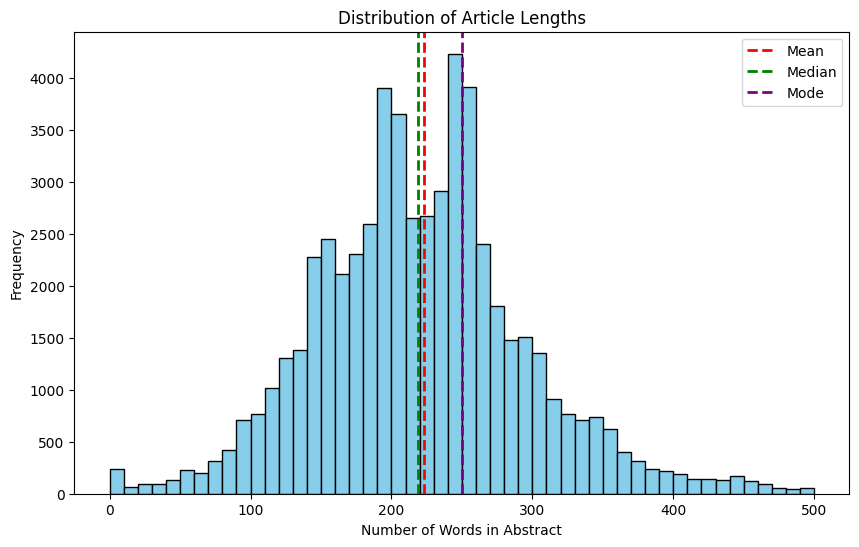

# Project_Medical_INLPT_WS2023

## Title: Project Medical

### Team Members

| SL | Name               | Matriculation Number | Email                                     | Github-ID         |
|----|--------------------|----------------------|-------------------------------------------|-------------------|
| 1  | Abhinand Poosarala | 3770895              | <abhinand.po@gmail.com>                     | Abhinand-p        |
| 2  | Behrooz Montazeran | 3769073              | <behrooz.montazeran@stud.uni-heidelberg.de> | BehroozMontazeran |
| 3  | Hussein Abdulreda  | 3769915              | <hussein.abdulreda@stud.uni-heidelberg.de>  | HRida             |
| 4  | John Hildenbrand   | 4170813              |  <john-hildenbrand@gmx.de>                  | Johncrtz          |

### Advisor: Ashish Chouhan

### Anti-plagiarism Confirmation

&nbsp;&nbsp;&nbsp;&nbsp;&nbsp;&nbsp; By submitting this work, We confirm that it is entirely our own original creation and that We have not plagiarized any material from any source. We have cited all sources used appropriately, and any similarities found with existing works are purely coincidental. We understand that any form of plagiarism is strictly prohibited and may result in severe consequences, including academic penalties.

### Responsibilities

| Data Acquisition | Data Preprocessing | Data Retrieval   | Frontend | Backend |Evaluation| Docker virtualization |
|------------------|--------------------|------------------|----------|---------|----------|-----------------------|
| Abhinand         | Behrooz            | ALL TEAM Members | John     | John    |John      | Hussein               |
| Behrooz          | Abhinand           |                  | Hussein  | Hussein |Abhinand  |                       |

## Introduction

why the project and underlying problems are interesting and relevant and it should outline the rest of your report.
The introduction also outlines the key ideas of your approach without going into the details in terms of realization and implementation.
It is also possible to give an outlook of the results the reader can expect to see in the later sections.""")

&nbsp;&nbsp;&nbsp;&nbsp;&nbsp;&nbsp; In an era dominated by vast amounts of scientific literature, accessing and comprehending relevant information poses a significant challenge for researchers and professionals.
Our project addresses this issue by implementing a Retrieval Augmented Generation (RAG) system connected to GPT-3.5 and Llama 2, a state-of-the-art language model developed by OpenAI and Meta.
This system aims to facilitate the extraction and synthesis of information from articles containing 'Intelligence' hosted on PubMed [1](https://pubmed.ncbi.nlm.nih.gov/), a widely used database of biomedical literature.

The primary objective of our project is to provide an intuitive and efficient means for users to query articles stored from PubMed and receive comprehensive and contextual relevant answers to their questions.
As none of the LLMs are working with updated data, they all suffer from providing answers based on most recent information.
By leveraging the capabilities of GPT-3.5 and integrating it with a retrieval mechanism, we empower users to pose natural language queries and obtain synthesized responses tailored to their information needs based on most recent data.

In this report, we provide an overview of our project, including its motivation, methodology, and implementation details.
We outline the key concepts and techniques employed in our approach, offering insights into how the integration of GPT-3.5 and PubMed enhances the information retrieval and synthesis process.
Furthermore, we present the results of our experiments and evaluations, showcasing the effectiveness and performance of our RAG system.
Finally, we discuss potential applications, limitations, and future directions for extending and refining our approach to meet evolving user needs and technological advancements.

## Related Work

This includes papers that you used as a basis for your approach or papers that used the same techniques as you did but applied them to a different problem.
In this section, you should emphasize how your work differs from previous work, e.g., by outlining the limitations of previous work, or why your application domain is different from those other researchers have already investigated.
However, you should not go into all the details about any of the work you cite, instead, you should outline how the major points of previous work relate to your project.""")
&nbsp;&nbsp;&nbsp;&nbsp;&nbsp;&nbsp; In reviewing prior work pertinent to our project, we delve into the evolving landscape of knowledge-intensive natural language processing tasks.
Central to our investigation is the seminal work of Lewis et al. (2021) [9](https://arxiv.org/abs/2005.11401), which underscores the challenges
posed by existing large pre-trained language models in accessing and manipulating knowledge effectively.
Their exploration of retrieval-augmented generation (RAG) models, which integrate both parametric and non-parametric memory mechanisms, serves as a pivotal precursor to our research.
Drawing inspiration from this foundation, we formulate a fine-tuning recipe for RAG models tailored to our objectives, leveraging a pre-trained language model in conjunction with a dense vector index.
By contextualizing our work within this framework of prior research, we not only acknowledge the foundational contributions but also establish a trajectory for advancing the efficacy of knowledge-aware NLP systems.

## Methods/Approach

&nbsp;&nbsp;&nbsp;&nbsp;&nbsp;&nbsp; In the following parts, all the methods that are used to accomplish the final project are addressed.
Those, that are labeled as [Outdated] are part of an experiment we did but not used in the final product.

### Data Acquisition

&nbsp;&nbsp;&nbsp;&nbsp;&nbsp;&nbsp; From the PubMed section intelligence [2](https://pubmed.ncbi.nlm.nih.gov/?term=intelligence+%5BTitle%2Fabstract%5D&filter=simsearch1.fha&filter=years.2013-2023&sort=date&size=200), we gathered abstracts between 2013-2023 that contains the term 'Intelligence' from PubMed.
To do this, we provided a different technique that is clarified as follows:

1. API:
   - By this approach, we downloaded the xml file, which was later processed and the useful data extracted, using the preprocessing notebook, and finally the csv file of the related data was created.
   - As the whole dataset was too big to be pushed to GitHub, we used hugging-face to host our dataset. This also changed later by storing the dataset and their embedding on opensearch.
   - Here we also experimented with multiprocess API calls but ended but getting blocked by the PubMed client due to multiple requests.
2. EDirect Fetch: [Outdated]
   - Though this method has no constraints on record fetches, this led to time-consuming when compared to API method.
3. Crawler: [Outdated]
   - Using this method, we implement a crawler using selenium to extract each abstract, its title and the respective authors from PubMed one by one.

### Data Preprocessing

&nbsp;&nbsp;&nbsp;&nbsp;&nbsp;&nbsp; During this phase of the project, we engaged in the utilization of XML files sourced from PubMed,
aiming to extract a comprehensive set of 17 metadata attributes accompanied by their corresponding data points.
Subsequently, in the subsequent phase, we proceeded to curate an additional dataset comprising solely the unique identifiers
(PMID) alongside amalgamated columns encompassing abstracts, titles, publication dates, author information, medical subject headings pertinent to each abstract and journal title.
The construction of this refined dataset facilitates enhanced analytical capabilities, thereby enabling the exploration and resolution of a wider array of inquiries, as delineated in our project objectives [Types of Questions and Answers](#types-of-questions-and-answers).
This augmentation of data granularity and scope contributes to the enrichment of our research endeavors, fostering deeper insights and robust conclusions within the domain under investigation.

### Data Storage

1. Pinecone/ FaunaDB: Cloud based, split approach [Outdated]
We initially planned on using a cloud-based vector DB so that it's easier to collaborate within the Team. Once we decided for Pinecone, we noticed that our Metadata that we have for each chunk was too big to be handled by Pinecone so we decided to outsource it to FaunaDB. We would retrieve a document by first finding the top k matches between the embedded query and stored vectors (cosine similarity) in Pinecone and then use the ids from the top k matches to query text+metadata. Although this approach worked fine, we noticed that the more sophisticated our whole project would get, the more complicated it would be efficiently managed our data and the more work-arrounds we would have to add for certain implementations.

2. OpenSearch: Locally
We decided to adopt OpenSearch for our Vector Store because its well documented, offers scalability and flexibility, is open source and provides a lot of in-built functionality such as IR with bm25 or hybrid search. We host openSearch inside a Docker container and provided one index for every chunking/retrieval strategy we implemented. Although using OpenSearch made it much easier to realize certain strategies regarding our pipeline and managing our data, a downside was that it made it much harder to work together and collaborate since it's not cloud based anymore. If someone came up with a new idea on how to vectorize our data, everyone that would like to work with that data would have to download it and upload it manually to his local OpenSearch container.

### Data Retrieval

### 1.Chunking/ Embeddings

 We tried a variety of different embedding models, from finetuned ones to "general purpose" ones, some with a higher and some wih lower dimensional sized output. In the terms of chunking we experiemented with three different approaces that differ in their granularity. We tried the most and least granular approach (sentence-/abstract-sized chunks) as well as something in the middle (chunking abstracts after a fixed amount of tokens). The following list provides an overview of the different approaches we took for vectorizing our data. All of these approaches are implemented and testable on our website.

1. e5-base-V2, embed chunks and store chunks in abstract
   - "E5 is a general-purpose embedding model for tasks requiring a single-vector representation of texts such as retrieval, clustering, and classification, achieving strong performance in both zero-shot and fine-tuned settings." 768 Output dimension, 512 input size
   - Chunk abstract after 512 tokens, between each chunk of an abstract create overlapping chunks
   - Added 'local context' to each chunks metadata which is the text that appears before and after the chunk (local context appr. 20% of abstracts size). This will later on be concatinated with the chunks text so that the model in charge of answering the prompt has a better understanding of the chunks role in the abstract itself (context)
   - We embedded and stored each chunk to our vector space which resulted in appr. 68k vectors
2. Voyage-2-large
   - This is a top performer on the current MTEB leaderboard (<https://huggingface.co/spaces/mteb/leaderboard>) and supports a context length of up to 16000 tokens while outputting 1536 dimensional sized vectors.
   - Since this model has such a large contect size, we tried experimenting with a one-embedding-per-abstract strategy.
3. Text-embedding-3-large
   - This openAI embedding model is also on the top ranks on the Leaderboard and allows for a context size of up to 8191 tokens. Apart from any other embedding model, openAI provides us the option to decide on the dimensionality  on our own. It is possible to to choose any dimension between 1024 and 3072. Since the size of our abstracts (mean) is rather small, we decided for a dimensionaliy of 1024, also for the reason of avoiding any overfitting that could happend if the dimension is too large.
   - For this model we chose the one-embedding-per-abstract method again since we were able to fit them in whole.
4. PubMedBERT, per-sentence embedding
   - BERT model finetuned on PubMed data, information retrieval/ QA, maps into 768 dimensional vectorspace, up to 512 token.
   - Created one embedding per sentence
     -> Turned out to be badly implemented because models max input size was not taken into consideration so we didnt upload it
5. RoBERTa
   - This model allows for inputs of up to 512 tokens ad produces vectors of size 768. We chunked each abstract after 512 tokens and created one embedding foreach of those chunks

### Retrieval

For all chunking/ embedding strategies we provide, one can either perform a dense, sparse or hybrid search on our website. OpenSearch offers a lot of flexibily on how to configure a search method. In the follwing we will go further into detail of our retrieval methods:

1. Dense Retrieval:
We utiized the OpenSearch kNN search, which is a technique used to identify the "k" closest data points (neighbors) in a high-dimensional space to a given query point. In simpler terms, it finds the most similar data points based on their "closeness" according to a specific distance metric, which we set to cosine similaity.

2. Sparse Retrieval:
If a Sparse Retrieval is selected, OpenSearch utilizes BM25 per default. This is a probabilistic retrieval model used in information retrieval for sparse retrieval tasks. It calculates document relevance scores based on term frequency (TF), inverse document frequency (IDF), and document length, effectively handling variations in document length. BM25 considers the frequency and distribution of query terms across the collection, resulting in efficient and accurate retrieval of relevant documents.

3. Hybrid Search
While Dense Retrieval finds thematically similar documents even if keywords differ, and Sparse Retrieval efficiently matches exact keywords, Hybrid Search combines both for comprehensive and accurate results. This approach leverages Dense Retrieval's semantic understanding and Sparse Retrieval's keyword matching, ensuring users find relevant content regardless of phrasing while maintaining efficiency. Additionally, weighting these methods allows tailoring the balance between semantic similarity and keyword accuracy, in our case we weighted them equally. In implementing this we sucessfully enabled to query by metadata (e.g.: "Whats the abstract with PMID = 267852 about?") which the dense retrieval couldn't leverage, no matter which configuration we chose.

### 2. Approach

- In this methodology, drawn from the Transformer library, the AutoTokenizer module is employed to perform tokenization on the dataset utilizing the pretrained model 'sentence-transformers/all-distilroberta-v1' [4](https://huggingface.co/sentence-transformers/all-distilroberta-v1/blame/e5e0bbabc6e2c6e494a64b5018d1b40775b173a7/README.md). This process is facilitated by the 'RecursiveCharacterTextSplitter' function from the langchain.text_splitter module. Given the constraint that the maximum input length for this model is 512 tokens, yielding an output dimensionality of 768, a decision was made to partition the data into chunks of size 400, with a 50-token overlap between consecutive chunks. This strategy is implemented to preserve the contextual coherence within each abstract. The adoption of character-based splitting ensures a degree of robustness to misspellings, thereby enhancing the model's retrieval capabilities. Admittedly, chunking the data results in an increased number of units, yet it concurrently enhances the efficiency of data retrieval and search operations. This trade-off between granularity and efficiency underscores the pragmatic considerations governing the data preprocessing stage in natural language processing tasks.

### 2. TF-IDF [Outdated]

- In this Approach we used the TfidfVectorizer from sklearn and set the analyzing level to characters which provided us the misspelling tolerance. Moreover, we used nltk to add the synonyms to the search of most k relevant abstacts.

## Types of Questions and Answers

The provided final product can answer the following question types:

1. Confirmation Questions [yes or no]:
   - Is Moog the author of article 'CASK Disorders'?

2. Factoid-type Questions [what, which, when, who, how]:
   - Who is Moog?
   - which articles were published in 2015?
   - What is CASK Disorders?
   - How to treat the CASK Disorders?

3. List-type Questions:
   - List the name of authors of article 'CASK Disorders'.

4. Causal Questions [why or how]:
   - Why is lung cancer deadly?

5. Hypothetical Questions:
   - What would happen if CASK Disorders is not treated?

6. Complex Questions:
   - What is relation of CASK Disorders in increasing the rate of breast cancer?

## Experimental Setup and Results

### Data

After scraping the medical data from pubmed we ran some data analysis to get a picture of the size of our data:

Most abstracts have a length of around 220 words which corresponds, depending on the exact tokenizer, to arround 350-400 tokens.
Each abtract comes with 15 metadata attributes, so when we first structured our dataset we did it in such a way that we would have the following strucutre for each abstract:

- [id, context, metadata1, metadata2 ...]

Where context is the text of the actual abstract, the respective vector representation of the context would be appended later on to this list.
Allthough this structure served our purpose, theres one obvious flaw which is not being able to query for metadata since it's not part of the embedding. For this reason, we created a new dataset where we would format the data of each abstract in the follwing manner:

- [id, context + metadata]

By this we managed to encapsulate some of the semantical meaning of the metadta into our vector embedding.

## Experimental Details

### Evaluating our Pipeline

A RAG pipeline is composed of multiple parts and provides plenty of differen ways on how to configure it. Everyone in our group had different ideas on how to chunk, embed or store the data or which LLM would be best to generate an answer. Thats why it was important for us to have some kind of comparison between all the different configurations.

In general, evaluating RAG pipelines is hard. You need to assess both how well information is retrieved and how effectively it's used for generation. Additionally, biases in the LLM and the quality of retrieved context can significantly impact the final output. RAGAS (<https://github.com/explodinggradients/ragas>) stands out here because of its metric-driven approach. It offers a comprehensive suite of metrics for retrieval relevance, factual consistency, and linguistic quality. This allows for targeted optimization based on data, not just guesswork. With RAGAS, one can pinpoint weaknesses and refine his RAG pipeline for better overall performance.
Another strong strength of RAGAS is its oportunity to create Synthetic Test Data which include Question-Answer (Groundtruth) pairs that can be used for evaluation. We initally tried to create them on our one with different LLMs and sophisticated querries but couldnt manage to bring the data up to a certain quality. RAGAS however provides a usefull framework for that, after providing our textual data, an LLM (GPT 3.5 Turbo) and a configuration about the type of questions, it provided diverse and interesting questions, along with correct answers to them. We created 100 Question-Answer pairs with the following distribution:

- simple 0.25
- reasoning: 0.5
- multi_context: 0.1
- conditional: 0.15

(See official documentation for more information on question types: <https://docs.ragas.io/en/stable/getstarted/testset_generation.html>)

When actually assessing the metrics one can either choose to use a custom LLM or to take the default variant which is using openAI's GPT 3.5 Turbo. It turned out using the default option is very cost expensive which is why we tried to use a local llama2-7b-chat-hf instead. This however wasn't feesable aswell since with the amount of questions even our strongest available machine ran of GPU memory (64 GB). So we decided a compromise by using openAI but therefore reducing the number of questions we use for evaluating our pipeline.
We ran the 30 question-answer pairs through some of our different pipeline configurations and collected the respective Answers/ retrieved contexts into a new Data set. We then evaluated these over 5 metrics, 2 for the retrieval (Context Relevancy and Recall) and 3 for the generation (Answer Relevancy and Faithfullness):

Since all testing was done with the same LLM for the generative part, excpt for the answer relevany the other 2 generation metrics stayed relativly constant.

While all embeding models outperformed the bm25 based baseline, their retrieval metrics for dense retrival and Hybrid Search didn't differ drastically from each. The reason why the context Relevancy is rather low comes from the nature of how this metric is assessed. Its the ratio of sentences of the context which exclusively contain essential information about the query to the toal number of sentences in the context. Since the approaches utitlized a rather high chunking size, its possible that the returned doucments contained a lot of overhead that isn't related to the query. This effect would get increased the more specific a question is.
Something to note is that allthough the Voyage model has a larger dimension for output, its retrieval performance compared to the Text-embedding-3-large with respect to dense and hybrid search isn't significantly better. However Both Conigurations with the higher Dimension outperform the e5 embedding model. Allthough based on the metrics for retrieval one cant see a major difference between Dense and Hybrid search, by testing we found out that unlike the dense retrieval our hybrid search was able to pick up semantics of the metadata if a user specifically asks for it. This probably happens due to the utilization of both sparse and dense retrieval in which both approaches strength is combined.

### ChatBot infrastructure

Our Chatbot application is realized with a website that is hosted via 2 dedicated servers. The front end is build with NodeJS, React and Typescript while the Backend is built with fastapi and uvivorn. THe reason why we didnt stick with NodeJS for the backend was becuse our backend utilizes a lot Langchain / Huggingface / Opensearch integration. All of these are much more simpler to work with when using Python instead of JavaScript/Typescript.

- Frontend
Our frontend provides a Chat interface wher the User if able to ask questions. The Chat interface provides a conversational history and gives a feedback on when the pipeline is procesing his query.
As we already stated, we experimented with a number of different chunking and embedding strategies and since all of them performed reasonable we wanted to give the user an option to configure his own pipeline. We therefore took our best performing approach (Hybrid search, Voyage-2-large and GPT 3.5. turbo 0125) and provided it as a default configuration, but if the user clicks on a "Advanced Mode" button he has the freedom to customize it. The pipeline is also able to provide a source to the answer it just gave.

- Backend
Our backend is our interface to all other third party technologies we used. After receiving in a query from the frontend, the /pipeline endpoint is called which analyzes the received configuration and processes the question accordingly.

- Configurations:
The user is able to select from the following options

Retrieval Method: Sparse Retieval, Dense Retieval, Hybrid Search

Index: text-embedding-3-large , distilroberta, e5-base-v2, voyage-2-large

LLM: GPT 3.5 Turbo 0125, GPT 3.5 Turbo 0125 (Langchain RetrievalQA), LLAMA2 7b chat hf, and biobert-v1.1-pubmed-squad-v2 which is hosted on Azure Cloud

The user is also able select query transformation and in case he decides or the GPT 3.5 Turbo 0125 (Langchain RetrievalQA) may specify a Chain type thats used in the RetrievalQA.

### Query Transformation Technique

&nbsp;&nbsp;&nbsp;&nbsp;&nbsp;&nbsp; We've implemented a query transformation technique within our application,
leveraging the LangChain MultiQueryRetriever [7](https://python.langchain.com/docs/modules/data_connection/retrievers/MultiQueryRetriever).
This approach aims to streamline the process of finding relevant articles within our PubMed dataset by enhancing query generation.

Using ChatGPT Turbo 3.5, we simplify the original query through prompt engineering, generating new queries.
These queries undergo evaluation in the GloVe embedding word space to measure semantic similarity, aiding in the retrieval of multiple relevant queries.
We've chosen to limit our selection to the top two generated queries.

The consolidated contexts from these queries are then fed into the user's preferred Language Model (LLM) to generate answers.
Our primary objective with this methodology is to break down complex questions into more digestible segments, facilitating the retrieval of independent articles or chunks of information.

### Conversational Retrival Chain

&nbsp;&nbsp;&nbsp;&nbsp;&nbsp;&nbsp; In our conversational retrieval chain, we've integrated LangChain to enhance the interaction experience.
This mechanism allows us to seamlessly retrieve relevant conversational cues and responses to user queries.

Using LangChain's [8](https://js.langchain.com/docs/modules/chains/popular/chat_vector_db) capabilities, we've structured our system to identify conversational patterns and retrieve appropriate responses based on user inputs.
By analyzing the context and intent behind each interaction, LangChain enables us to maintain a coherent conversation flow.

This approach ensures that users receive timely and contextually relevant responses, enhancing the overall conversational experience.
Whether it's providing information, answering questions, or engaging in dialogue, LangChain empowers our system to deliver meaningful and engaging interactions.

## Conclusion and Future Work

on the limitations of your work. Potentially, you can also outline how your model can be
extended or improved in the future, or you can briefly give insights into what you have
learned during the project.)
&nbsp;&nbsp;&nbsp;&nbsp;&nbsp;&nbsp; In our endeavor, we have made significant strides in implementing retrieval-augmented generation (RAG) by presenting a diverse array of retrieval strategies.
These include Sparse, Dense, and Hybrid search retrievals, each employing distinct embedding and chunking strategies to enhance the effectiveness of knowledge retrieval.
A notable aspect of our approach is the flexibility afforded to users in selecting their preferred large language model (LLM) from options such as GPT-3.5 turbo, Azure ML, and Lamma2, thereby accommodating varied preferences and requirements.
Additionally, we have introduced query transformation techniques aimed at decomposing complex questions to facilitate more targeted data retrieval.
Moreover, recognizing the importance of maintaining context in conversational settings, we have integrated conversational retrieval techniques to preserve the conversation history, ensuring coherence and relevance in subsequent interactions.

As a potential avenue for further improvement, we envision implementing a unified history storage mechanism that remains independent of the specific model chosen by the user.
This would enable seamless traversal of conversation history across different models, offering users a consistent and comprehensive repository of past interactions.
By decoupling the history storage from the model selection process, we aim to enhance the continuity and coherence of conversations, irrespective of shifts in model preferences or requirements.
This functionality would not only facilitate more informed and contextual relevant responses but also empower users with greater flexibility and control over their interactions.
By bridging the gap between different model choices and preserving historical context, we strive to enhance the overall user experience and effectiveness of knowledge-intensive NLP tasks.

## Our one click demo of our product

The video can be found here:
[ChatBot-DEMO.mkv](ChatBot-DEMO.mkv) or can be viewed in youtube by clicking the below image.

## References

report and refer to the author's name and year in the text, e.g., [Gertz et al.
2020]#link-to-the-bib-section. Make sure you follow proper citation methods and include
all author's names, the name of the journal or conference, the full title of the paper, and the
publication year.)

1. [National Center for Biotechnology Information. (n.d.). PubMed. Retrieved Oct. 30, 2023](https://pubmed.ncbi.nlm.nih.gov/)
2. [National Center for Biotechnology Information. (n.d.). PubMed. Retrieved Nov. 05, 2023](https://pubmed.ncbi.nlm.nih.gov/?term=intelligence+%5BTitle%2Fabstract%5D&filter=simsearch1.fha&filter=years.2013-2023&sort=date&size=200)
3. [OpenSearch. (n.d.). About OpenSearch. Retrieved Feb. 01, 2024](https://opensearch.org/docs/latest/about/)
4. [Hugging Face. (n.d.). README.md. Sentence Transformers - DistilRoBERTa, a distilled version of RoBERTa. Retrieved Feb. 01, 2024](https://huggingface.co/sentence-transformers/all-distilroberta-v1/blame/e5e0bbabc6e2c6e494a64b5018d1b40775b173a7/README.md)
5. [RAGAS](https://github.com/explodinggradients/ragas)
6. [Generate a Synthetic Test Set](https://docs.ragas.io/en/stable/getstarted/testset_generation.html)
7. [Multi Query Retriever](https://python.langchain.com/docs/modules/data_connection/retrievers/MultiQueryRetriever)
8. [Conversational Retrieval QA](https://js.langchain.com/docs/modules/chains/popular/chat_vector_db)
9. [Retrieval-Augmented Generation for Knowledge-Intensive NLP Tasks by Patrick Lewis et al.](https://arxiv.org/abs/2005.11401)
